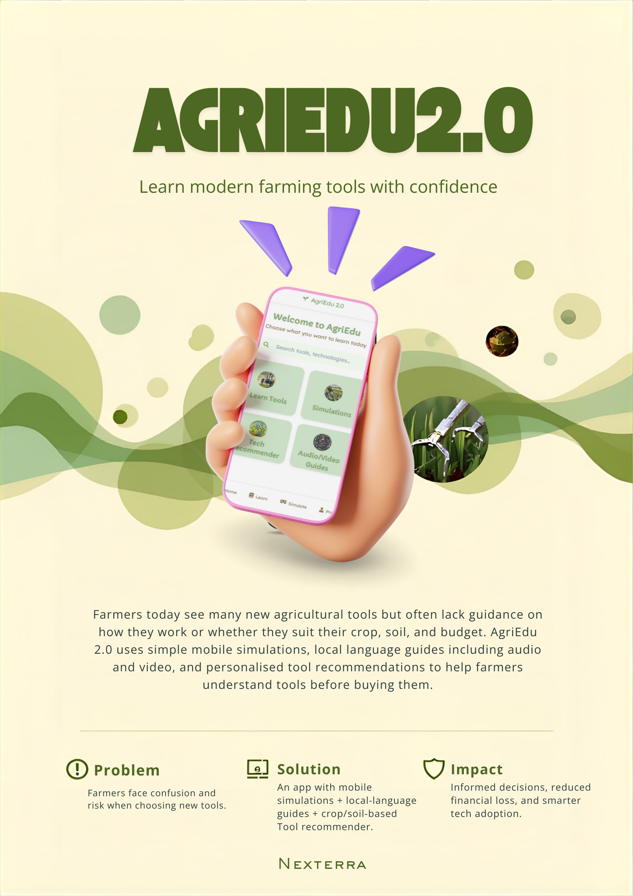

## Overview
AgriEdu 2.0 is a mobile-first agri-tech learning platform designed to help farmers understand and confidently adopt modern agricultural tools. It focuses on simplifying complex technologies through intuitive design, multilingual accessibility, and guided learning experiences.

## Problem
Farmers are increasingly exposed to new agricultural tools and technologies but often lack clear guidance on how they work, whether they are suitable for their crop and soil conditions, and whether they fit within their budget. This leads to hesitation, misuse, or financial risk.

## Solution
AgriEdu 2.0 provides a structured and accessible way for farmers to explore and learn about agricultural tools through:
- Mobile-based simulations to understand tool usage before adoption  
- Multilingual guides (including audio and video) for better accessibility  
- Personalized recommendations based on crop type, soil conditions, and budget  

## Impact
By making agricultural knowledge more accessible and easy to understand, AgriEdu 2.0 aims to enable informed decision-making, reduce financial risk, and encourage smarter adoption of modern farming technologies.

## Visual Preview

### Main Concept

